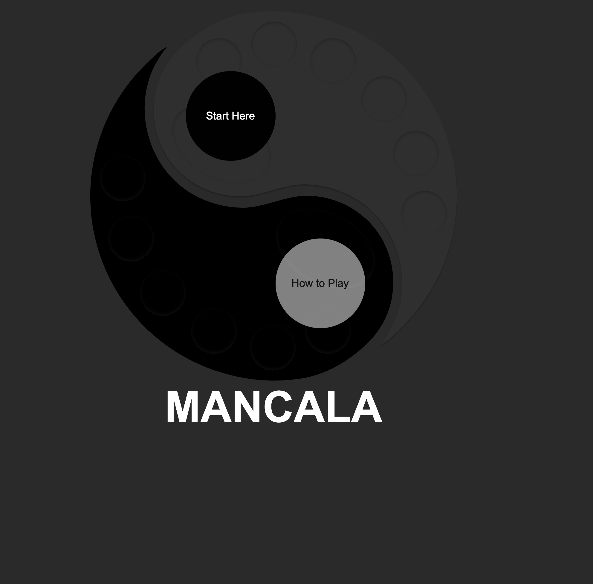
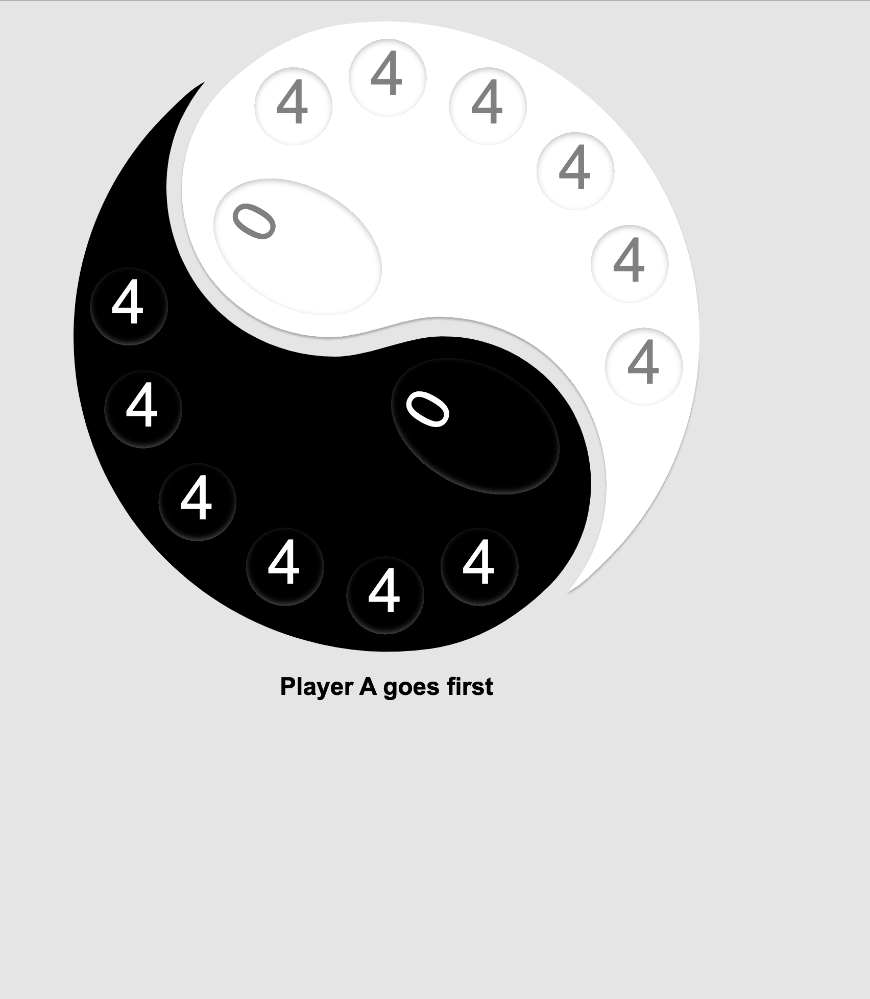
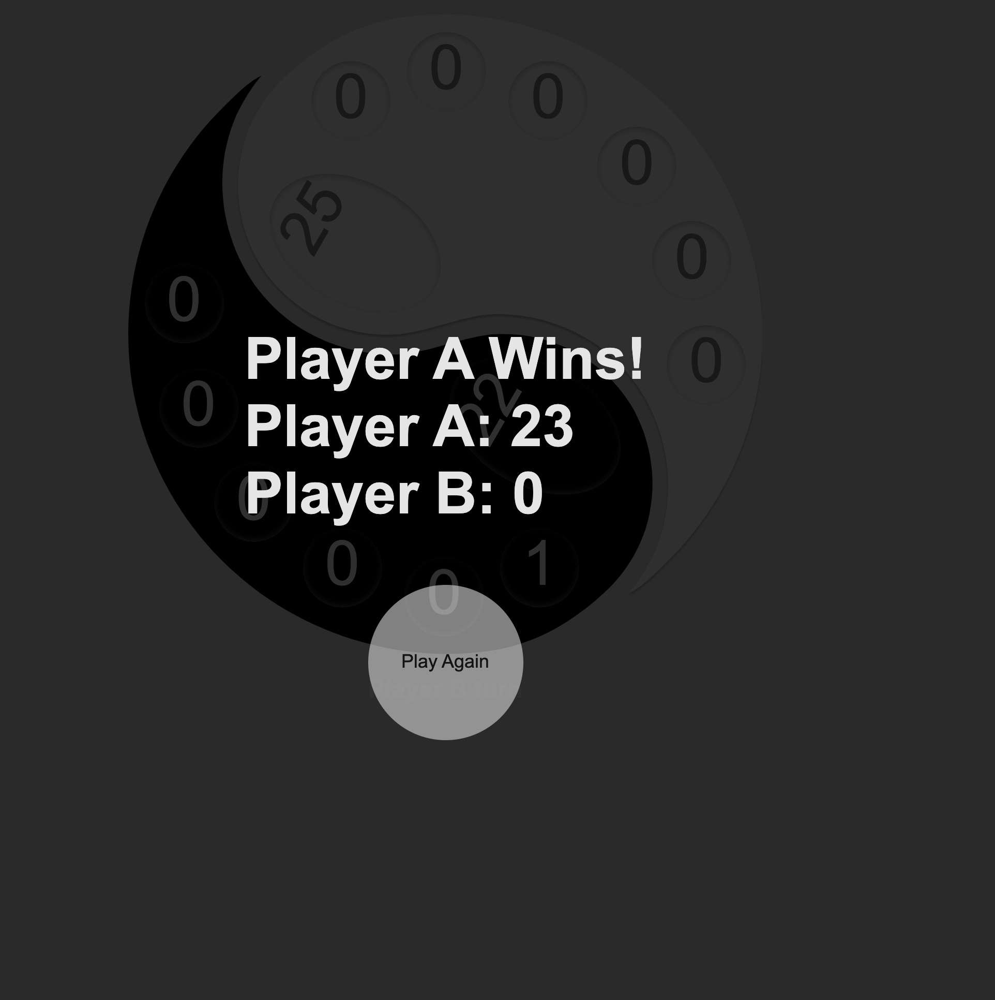

- **A ``README.md`` file** with these sections:

  ☐ **\<Your game's title\>**: A description of your game.  Background info of the game is a nice touch.
  
# MANCALA
Mancala is an African originated game which is played by 2 players. The game is performed on a Mancal Board which has  6 pits  and 1 Mancala( score pit) per player. There are 48 peices of marble that are distributed evenly in each players cup 9 4 per pit). 
The objective of each player is to collect as many marbles in their mancal as possible. below is a picture of a more traditional game board:

I however decided to get a bit more creative with the design of the game. Here is a look at the board I ceated:

## The Home Page:
With 2 choices to either start the game or watch a quick video as an explanation of the game. I though it would be helpfule as I didn't even know of this game at time of making the decision to make it. 

## Upon Start
This is how the marbles are distributed at the initial stage of the game . 

### The Rules:
* The game starts with Player A, 
* Each player gets one trun 
* Players can only take the stones from their side of the board
* *If* the last stone ends in the palyers Mancala, the player gets another round
* The game is over when all the pits from one side are empty at this poit the remaining side will collect all the marbles from their side and add to their mancala.
* The Player with most marbles in their Mancala is the Winner.

    

  
## Technologies Used.
* JavaScript
* CSS
* HTML  

### YOU CAN PLAY HERE
https://t4r4n3h.github.io/Mancala/

  

### ICE BOX ITEM:
 1. Create a sigle player
 2. Implement the second rule of the game : If a player's last marble ends in an empty pit on their side they get to take that marble and all the marbles of the opposite side and collect them in their Mancala. 
 3. Implement some appropriate music.
 

  I hope you enjoy this game! It was fun to write! 
  
  Cheers!

  
  